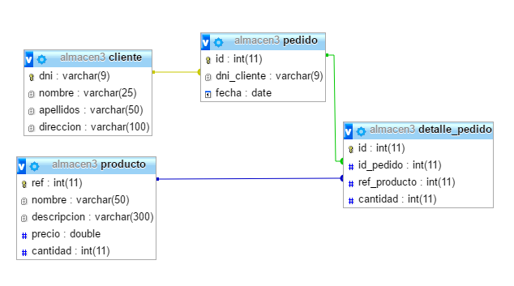
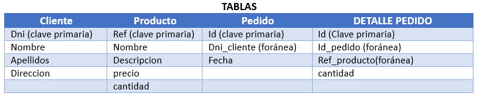
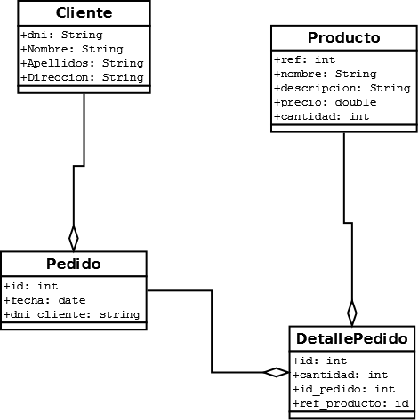
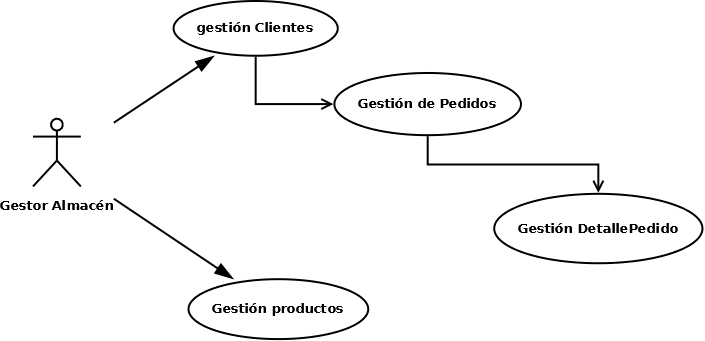
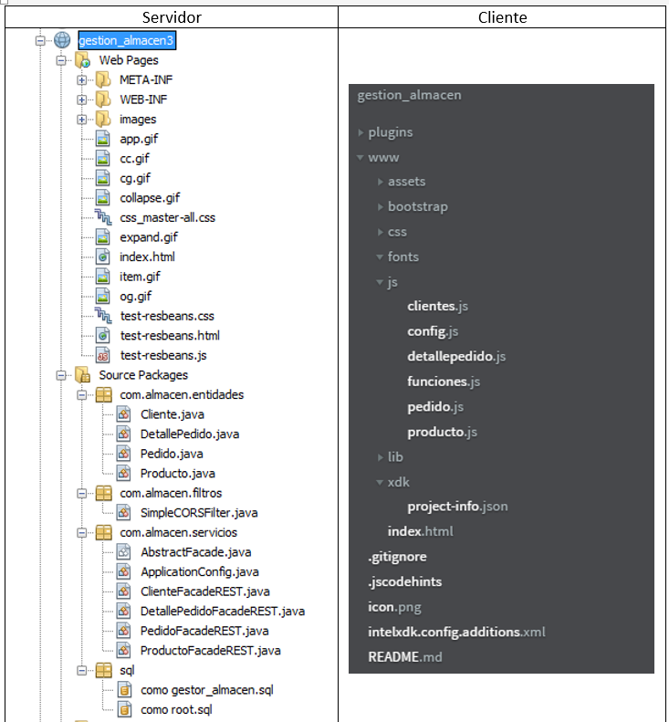
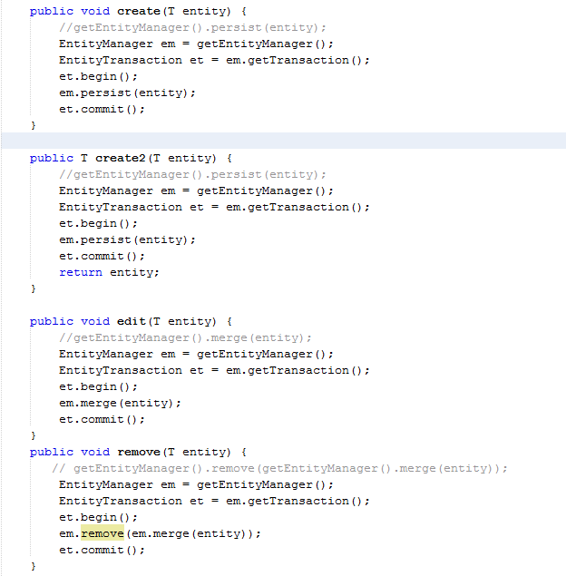
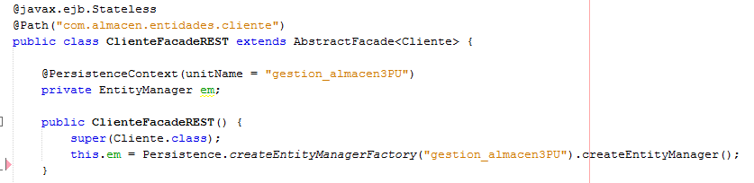
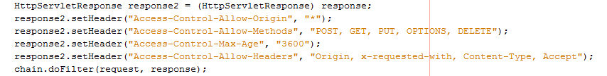

# GestionAlmacen
<h2> CRUD Almacén SERVIDOR </h2>

<h2>Introducción</h2>

	

		Este proyecto se centra en la implementación de un CRUD básico que permita la gestión de un almacén con los siguiente elementos fundamentales:

<ul>
	<li>Gestión de clientes</li>
	<li>Gestión de productos</li>
	<li>Gestión de pedidos</li>
</ul>

<h2>Metodología</h2>

Para la implementación del proyecto hemos usado las siguientes tecnologías:

<ul>
	<li>Backend:
		<ul>
			<li>Base de datos: MySQL (XAMPP)</li>
			<li>Servidor: Tomcat (versión 8.0.27.0)</li>
			<li>Servicio REST generado por Netbeans</li>
			<li>Base de datos: MySQL (XAMPP)</li>	
			<li>Principales librerías:
				<ul>
					<li>Java EE 7 Api</li>
					<li>MySQL JDBC driver</li>
					<li>Jersey 2.5.1</li>	
				</ul>
			</li>
			<li>IDE: Netbeans 8.2</li>
		</ul>
	</li>
	<li>Frontend
		<ul>
			<li>Lenguajes:
				<ul>
					<li>HTML5</li>
					<li>JQuery</li>
					<li>Estilo:Boostrap</li>	
				</ul>
			</li>
			<li>IDE: Intel XDK</li>
		</ul>
	</li>
</ul>

<h2>Estructura</h2>

<h3>Base de datos</h3>

Como root hemos creado la base de datos “almacén3” y el usuario “almace_gestor” (y contraseña “gestor”) con los permisos adecuados para gestionarla. 
Con dicho usuario hemos creado la siguiente estructura de tablas.

<h2>Diagrama Entidad/Relación</h2>

Para una mayor simplicidad, el detalle_pedido tiene una clave primaria autogenerada (en vez de tener una compuesta por id_pedido y ref_producto)

<h2>Diagrama UML</h2>

<h2>Casos de uso</h2>

<h2>Estructura archivos</h2>

<h2>Persistencia</h2>

Debido a que Tomcat no es un contenedor de EJB luego no soporta correctamente la inyección del EntityManagerFactory en las clases de los servicios. Por ello tenemos que hacer esta modificación en el CREATE, DELETE y EDIT 

<b>Archivo AbstractFacade.Java</b>

Igualmente hemos de modificar los archivos de cada entidad para añadir la siguiente línea en el constructor de cada clase:

<code>this.em = Persistence.createEntityManagerFactory("gestion_almacen3PU").createEntityManager();</code>

Por ejemplo, en el archive ClienteFacadaREST:

De esta forma resolvemos el problema de injección de dependencias.

<h2>CORS</h2>

Para resolver el problema de CORS desde los navegadores, podemos añadir este filtro. En mi caso lo he hecho desde el propio Netbeans: botón derecho sobre el proyecto/new y elegimos filter. He mantenido el código que se ha generado de forma automática salvo el método “doFilter” en el cual he sustuido el código que había por este:

